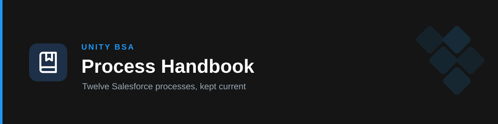

# unity-handbook

Unity's **BSA Process Handbook for Salesforce**. Twelve load-bearing processes were documented in detail at a handover in August 2026; this plugin turns that documentation into something the team can ask questions of — and keeps it honest against the live org instead of letting it decay into a stale snapshot.

It is built to grow into the team's **knowledge centre for answering tickets**: a reported symptom routes to the process that owns it, the answer names the check to run and who is allowed to run it, and anything the handbook never recorded is read from the org rather than guessed.

## How it works

- **Ticket-shaped, not just document-shaped.** A symptom index routes roughly 100 real user-reported problems to the file that answers them; ticket answers give the cause, the specific check, and whether the requester can self-serve or needs Business Operations or the SFDC team.
- **Answers from the handbook, not from general knowledge.** These processes move real money. When the handbook doesn't cover something, the skill says so and names the person to ask rather than producing a plausible guess.
- **Values reproduced exactly.** Thresholds, field names, picklist values and approver-matrix rows come back verbatim, full tables included — a partial approval threshold is worse than no answer.
- **Contradictions surfaced, not resolved.** Where the source states a value two ways, both are given, flagged as disagreeing, and sent to the org to confirm.
- **Freshness is explicit.** Answers naming a person, number, picklist value or permission grant carry the August 2026 snapshot caveat.
- **Kept current by design.** A second skill verifies documented claims against production and proposes reference-file edits, on a documented cadence — see [Staying current](#staying-current).
- **Reaches past the document when it has to.** Some mechanisms were never written down because they live in Apex or a scheduled job. Rather than guessing, a third skill reads the deployed code and cites it — see [When the answer is in the code](#when-the-answer-is-in-the-code).

## Skills

| Skill | What it does |
| --- | --- |
| [`handbook-processes`](./skills/handbook-processes) | Answers questions about the twelve processes — how one works, why it broke, who approves what, who owns it now — and diagnoses tickets. Routes by topic, or by symptom for a problem report, to exactly one reference file; reproduces values verbatim; surfaces the tab's known gaps and live issues. |
| [`handbook-refresh`](./skills/handbook-refresh) | Verifies handbook claims against the live Salesforce org (read-only) and produces a drift report with proposed reference-file edits. Tiers each claim by what is actually checkable, and refuses to declare drift from a single query. |
| [`handbook-code-lookup`](./skills/handbook-code-lookup) | Answers questions whose answer lives in Apex rather than the handbook — batch run times and cron schedules, what a class does, hardcoded thresholds, why an automation didn't fire. Reads deployed source from the org (read-only) and cites it; optionally consults the `SFDC-IS` repo for git history and flow XML. |

## What it covers

Dispute · Handover (HO) · Connect 360 · Game Design & Revenue Consultancy · Credit Check Auto Approval · Customer Community (support-ads.unity.com) · Knowledge · CSAT · Deals · Pipeline Summary · GPS · Bills/Invoice Sync

Ask directly — questions in Hebrew trigger the skill too, and are answered in English per Unity convention:

- "Who approves a dispute over $50k?"
- "The invoice wasn't created — what should I check?"
- "How does a deal turn into disputes?"
- "Who owns Connect 360 now?"

Or hand it a ticket as it arrived, without naming a process:

- "User says they approved the dispute but there's no Attach button — what do I tell them?"
- "She doesn't see the opportunity in pipeline review."
- "Customer says their ticket isn't showing in the portal."
- "Commission numbers are missing for a batch of accounts we handed over."

## Staying current

The handbook is a **snapshot from 9–10 August 2026**, and Salesforce configuration drifts continuously. Two things keep it true:

1. **The standing rule** — whoever changes one of these twelve processes updates its reference file **in the same PR as the change**.
2. **Scheduled verification** — a quarterly Tier 1 sweep alongside the SOX review cycle, and a semi-annual Tier 3 pass re-confirming thresholds and approver matrices with each process's business owner.

The `handbook-refresh` skill runs the verification and drafts the edits; a human reviews and merges them through the normal repo flow. Precedence when sources disagree: **the org → the repo's reference files → the source Google Doc**. The repo is what ships, so a correction made only in the doc changes nothing for users.

Full process, cadence table and definition of done: [`docs/handbook-maintenance.md`](../../docs/handbook-maintenance.md) and the skill's [`refresh-runbook.md`](./skills/handbook-refresh/references/refresh-runbook.md).

## When the answer is in the code

The handbook is prose written by a human, so it carries what a human thought to write down. Some things were never in it — batch run times, hardcoded thresholds, the precise reason an automation didn't fire — because they only ever existed in Apex or in a scheduled job's cron expression.

Asked *"when does the next bill/invoice cycle attach to invoices and bills?"*, a handbook-only answer is a guess: the tab describes the "waiting for next invoice/bill" flag and links a document about the batch, but states no times. `handbook-code-lookup` reads the deployed source instead and finds them — `Attach to next invoice` on the 2nd of each month at 20:00, `Attach to next bill` on the 4th, both Asia/Jerusalem, both live.

It also caught a **misleading warning**: the Dispute tab says the flow that applies these disputes is inactive and warns against promising anyone their dispute will attach. The flow is inactive — but those two scheduled jobs do the work and are running. The reference file now carries a `> **Verified:**` correction alongside the original text.

Deployed Apex, triggers and schedules are all read from the org. The `SFDC-IS` repository adds git history, review context and **flow XML** — which would make the approval thresholds machine-checkable, the biggest remaining gap. It's an internal host, so it works from local sessions on the Unity network but is blocked from managed remote sessions; the skill degrades honestly and says so.

## Boundaries

This plugin documents how existing processes work. It does not design or review Salesforce configuration (`unity-bsa`), and it produces no audit evidence — SOX access reviews, change-management review and the approver-matrix control belong to `unity-sox`.

## Install

- **Marketplace:** `/plugin marketplace add Yakov-Asael/unity-bsa-marketplace` → `/plugin install unity-handbook`.
- **Cowork:** Customize → Skills → Create plugin → Upload plugin → the `unity-handbook` `.plugin` file.

## Versioning

Current: **v0.1.0** (see `.claude-plugin/plugin.json`).

## Provenance

The twelve reference files were written by **Dror Diamant** on 9–10 August 2026, ahead of his departure on 10 September 2026, and are preserved verbatim. Each file carries its own `> Source:` line and names the business and technical owner taking the process over. Corrections confirmed against the org are appended as `> **Verified <date>:**` notes rather than overwriting the original text. Maintained by the Unity Business Systems team.

## Author

Unity Business Systems team.
