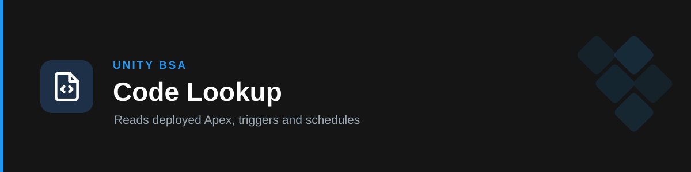

# handbook-code-lookup

**Answers the questions whose answer was never in the handbook** — batch run times, what an Apex class actually does, why an automation didn't fire, hardcoded thresholds. Reads deployed source directly from the org and cites it.

## Why it exists

A real failure. Asked *"when does the next bill/invoice cycle attach to invoices and bills?"*, the handbook-only skill answered wrongly. The handbook describes the "waiting for next invoice/bill" flag and even links a document about the batch — but states no run times. There was nothing to answer from, so the answer was invented.

The run times were readable the whole time. They're in two scheduled jobs:

| Job | Cron | Timezone | Reading |
| --- | --- | --- | --- |
| `Attach to next invoice` | `0 0 20 2 */1 ?` | Asia/Jerusalem | 2nd of each month, 20:00 |
| `Attach to next bill` | `0 0 20 4 */1 ?` | Asia/Jerusalem | 4th of each month, 20:00 |

And the bigger finding: the handbook's Dispute tab warns that `PE_Deduct_Add_dispute_to_invoice_or_bill` is INACTIVE and says not to promise anyone their dispute will attach next cycle. That flow *is* inactive — but **these two jobs are live and firing monthly**, so the warning is misleading. Exactly the class of error this skill closes.

## How it works

- **Reads deployed source, read-only.** `ApexClass.Body`, `ApexTrigger.Body`, `CronTrigger`, `FlowDefinitionView`. It never writes, deploys, or changes a schedule.
- **Quotes, never paraphrases from memory.** A class name is a hypothesis; the body is the evidence. Every behavioural claim traces to source retrieved in that session.
- **Separates WHAT from WHEN.** A `Schedulable` class contains no schedule — the cadence is org config in `CronTrigger`. Answering "when does it run" from the class body is the most likely way to get it wrong.
- **Reports contradictions with the handbook** instead of silently picking a side, and hands them to `handbook-refresh` to get the reference file corrected.

## Where it reads from

| Source | Holds | Availability |
| --- | --- | --- |
| **The org** (primary) | Deployed Apex and triggers, job schedules, flow active state | Always — via the Salesforce connection |
| **`unity/SFDC-IS`** (secondary) | Git history and blame, review context, undeployed code, **flow XML** | Local sessions on the Unity network only — see below |

## The four schedule traps

Encoded because each one produces a confidently wrong answer:

1. **Job names are free text** typed by an admin — they don't reliably match the class name. Search loosely.
2. **`State` matters as much as the cron.** `PAUSED` means not running. Four finance-adjacent bill/invoice jobs in this org are paused with fire times stranded in 2025.
3. **Timezone.** The cron is evaluated in `TimeZoneSidKey`; `NextFireTime` comes back in UTC. Quote both or be wrong by hours.
4. **Admin labels go stale.** `"BillCreationCustomCycleScheduler - Every 2 Weeks 12:00"` actually runs monthly on the 16th. Trust the expression, not the label.

## Repo access

`github.cds.internal.unity3d.com` is an internal host. From a managed remote session (Claude Code on the web) it returns a **403 egress-policy denial** — not an auth problem, and not worth retrying. It works from Claude Code on your own machine on the Unity network, ideally against a local checkout (`$SFDC_IS_PATH`).

The skill degrades honestly: if the repo is unreachable it says so, answers from the org, and names what's missing as a result. Full detail in `references/sfdc-is-repo.md`, including the shape of a Salesforce metadata repo and why **flow XML is the single biggest available upgrade** — it would make the handbook's approval thresholds machine-checkable, which is currently the largest unverifiable block.

## Triggers

when does the batch run, batch schedule, scheduled job, cron, next invoice batch, next bill batch, what does the class do, which Apex, Apex class, trigger, is it hardcoded, why did it not fire, read the code, check the code, SFDC-IS, scheduler, Schedulable, batch size.

## Boundary

Reads code; never changes it. Documented process questions → [`handbook-processes`](../handbook-processes). Verifying claims and updating reference files → [`handbook-refresh`](../handbook-refresh). Flow quality review and solution design → the `unity-bsa` plugin. Not a SOX control and produces no audit evidence → `unity-sox`.

## References

- `references/org-code-queries.md` — validated query catalogue (Apex bodies, triggers, schedules), the four schedule traps, this org's naming conventions, a confirmed schedule table for bill/invoice jobs, and what the org still cannot answer.
- `references/sfdc-is-repo.md` — repo reachability by environment, local-checkout resolution, metadata repo layout, what the repo adds over the org, and hard rules.
