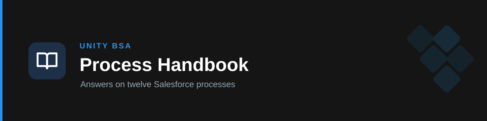

# handbook-processes

**Answers questions about the twelve Salesforce processes** documented in Unity's BSA Process Handbook — how one works, why it broke, who approves what, and who owns it now.

## How it works

- **One question → one reference file.** A routing table maps the ask to exactly one of twelve self-contained files. Only that file is read, which is what keeps answers fast.
- **Values verbatim.** Thresholds, field names, picklist values, approver names and table rows are reproduced exactly — full tables, every row, never summarised into prose.
- **No gap-filling.** If the file doesn't cover it, the skill says so and names the owner to ask. General Salesforce knowledge is either withheld or labelled explicitly as inference.
- **Contradictions surfaced.** Where a file states a value two ways, both are given and flagged as disagreeing, with a pointer to confirm in Setup.
- **Known gaps flagged.** Missing PRDs, known defects, live issues and stale permissions are surfaced when they bear on the question, rather than letting the answer read cleaner than reality.
- **No section numbers.** The source's `§n` pointers are unreliable — several reference renumbered or non-existent sections — so they're stripped rather than cited.

## Coverage and routing

| Ask is about | File | Current owner |
| --- | --- | --- |
| Disputes, credit notes, changing an invoice/bill amount, the tiered approval chain, approver matrix, SOX approval evidence | `dispute.md` | Noam Abutbul |
| Account handover, "HO", ownership moves, quota and commission, managed vs unmanaged | `handover.md` | Neta Ronen |
| Connect 360 / "C360", performance requests, drop investigations, benchmarks, QBRs, routing matrix | `connect-360.md` | Hagar Itzhak |
| GDRC, the `Game_Monetization` Case record type, its notification emails | `game-design-revenue-consultancy.md` | Hagar Itzhak |
| Credit check, auto approve/reject/manual review, the reduced-amount formula, credit limits | `credit-check-auto-approval.md` | Yakov Asael |
| support-ads.unity.com, Experience Cloud, the 18 LWCs and 7 Apex controllers, Unity ID auth, portal case visibility | `customer-community.md` | Neta Ronen (dev: Danill Rekov) |
| Knowledge articles, authoring and publishing, article approval, ratings, portal visibility | `knowledge.md` | Neta Ronen |
| CSAT, case satisfaction ratings, FormTitan, Version A vs B | `csat.md` | Neta Ronen |
| Deals, Deal Desk, the deal wizard, incentives, tiers, Supply vs Demand, deal→dispute | `deals.md` | Yakov Asael |
| Pipeline Summary, the CRMA dashboard, `Sales_CRMA_Admin__c`, the dataflow and recipe | `pipeline-summary.md` | Noam Abutbul |
| GPS, Direct vs Indirect, the Parent → AoR → Brand → Opportunity hierarchy, Opportunity Split | `gps.md` | Yakov Asael |
| `Invoice__c` / `Bill__c`, Invoice & Bill Management screens, Workday sync failures, stuck approvals | `bills-invoice-sync.md` | Yakov Asael |

Ambiguous terms are disambiguated rather than guessed: "ticket" has three senses (C360, GDRC, `/centro gtm`), and "approver matrix" exists separately for Dispute, Deals and Bills/Invoice.

## Language

Always answers in **English**, per Unity convention, including when asked in Hebrew — the team is mixed and the handbook is written in English. Hebrew trigger keywords are included so Hebrew questions still fire the skill. Salesforce identifiers always stay in English.

## Freshness

The reference files are a **snapshot from 9–10 August 2026**. Answers naming a person, number, picklist value or permission grant carry that caveat; answers purely about mechanism (which flow fires, which object writes what) do not. For the *current* org value rather than the documented one, the skill hands off to [`handbook-refresh`](../handbook-refresh); for a mechanism the handbook never carried, to [`handbook-code-lookup`](../handbook-code-lookup). It never queries Salesforce itself.

A reference file may carry a `> **Verified <date>:**` note — a correction confirmed against the org, kept alongside the original text for provenance. Those notes supersede the line above them.

## Triggers

handbook, process handbook, approver matrix, dispute, credit note, C360, GDRC, portal, knowledge article, deal desk, incentive, invoice, bill, Workday sync, SOX evidence, who approves, who owns this, who took over — plus Hebrew equivalents (דיספיוט, מי מאשר, חשבונית, ביל, האנדאובר, פורטל, דיל, פייפליין, מי אחראי על זה עכשיו).

## Boundary

Answers from the handbook only. Org verification and reference-file updates are [`handbook-refresh`](../handbook-refresh); mechanisms that live in Apex or a scheduled job — batch run times, hardcoded thresholds — are [`handbook-code-lookup`](../handbook-code-lookup). Designing automation, reviewing Flow XML and writing PRDs belong to the `unity-bsa` plugin; SOX controls belong to `unity-sox`; outbound stakeholder comms belong to `unity-comms`.

## References

`references/` — twelve process files, one per tab: `dispute.md`, `handover.md`, `connect-360.md`, `game-design-revenue-consultancy.md`, `credit-check-auto-approval.md`, `customer-community.md`, `knowledge.md`, `csat.md`, `deals.md`, `pipeline-summary.md`, `gps.md`, `bills-invoice-sync.md`. Each preserves its original `> Source:` provenance header and names its business and technical owner.
