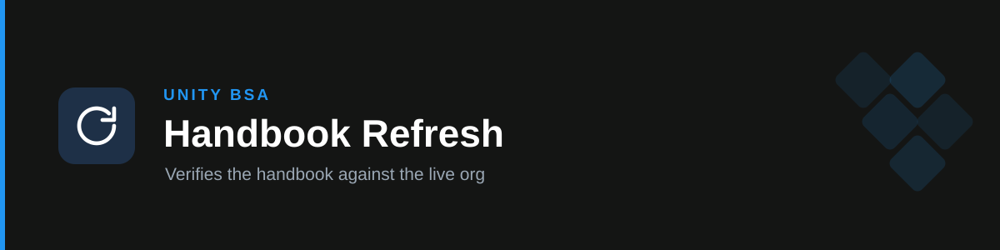

# handbook-refresh

**Keeps the BSA Process Handbook honest.** Verifies documented claims against the live Salesforce org, produces a drift report, and proposes reference-file edits for review — so the handbook stays current instead of decaying into a stale snapshot.

## How it works

- **Read-only against Salesforce.** `soqlQuery` and `getObjectSchema` only. It never writes to the org and never changes configuration, even when the fix looks trivial.
- **Proposes, never applies.** It drafts the exact reference-file edit; a human reviews and merges it through the normal repo flow. No silent rewrites.
- **Tiers every claim** by what is genuinely checkable, so a clean automated pass is never mistaken for full assurance.
- **Refuses single-query verdicts.** Sibling metadata types must be ruled out before anything is reported missing.

## Claim tiers

| Tier | Claim class | Verdict strength |
| --- | --- | --- |
| **1 — Automated** | Flow existence and active state, approval processes, record types, object/field existence, picklist values, permission sets, custom permissions, whether named people are still active | Authoritative |
| **2 — Partial** | Which object a flow runs on, trigger type, field types — the wiring, not the logic | Directional; states what wasn't confirmed |
| **3 — Manual** | Thresholds and branch logic *inside* a flow, approval step counts, approver matrix rows, validation rule messages, email recipients, button visibility, ownership, live-issue notes | **Unverifiable here** — reported as `NEEDS MANUAL CHECK` |

The handbook's most business-critical content — approval thresholds and the approver matrix — is largely **Tier 3**. The skill says so explicitly rather than implying broad assurance from a clean Tier 1 sweep.

## The false-drift trap

Salesforce names collide across metadata types, and a false "this is gone" sends someone to change production. The worked example, from this handbook: it states the fraud mass-approve screen needs `Supply_Fraud_Dispute_Approver_1` / `_2`. A `PermissionSet` query returns **nothing** — which looks like obvious drift. They exist as **`CustomPermission`** records. The handbook was right; the query was wrong.

So before any `DRIFTED` / `GONE` verdict: try sibling types (`PermissionSet` **and** `CustomPermission`; `FlowDefinitionView` **and** `ProcessDefinition`), try the label and a `LIKE` search for renames, then report — naming which types were ruled out.

## The duplicate-user trap

The handbook names ~20 people, and departures are its fastest-rotting content. But this org holds **multiple User records per person** (typically one populated, one sparse, same email). The skill returns every matching row and reports someone as departed only when **all** their records are inactive — one inactive row beside an active one is normal and is not a finding.

## Output

A drift report table — one row per claim, with `✅ MATCHES` · `⚠️ DRIFTED` · `🛑 GONE` · `🆕 NEW` · `⚠️ NEEDS MANUAL CHECK` — ordered so anything that would make a `handbook-processes` answer actively wrong comes first. Then the proposed reference-file edits (exact file, current line, replacement line), the snapshot dates that must move with them, and a single Next Step.

## Triggers

refresh the handbook, update the handbook, is the handbook still accurate, handbook drift, verify against the org, re-sync handbook, handbook review, handbook out of date, stale handbook, does this still match production, quarterly handbook check.

## Boundary

Verification and proposed updates only. Process questions are [`handbook-processes`](../handbook-processes). Flow quality review and solution design belong to the `unity-bsa` plugin. This skill is **not a SOX control and produces no audit evidence** — access reviews, change-management review and the approver-matrix control belong to `unity-sox`; a drift check that surfaces an access exception hands it there. It does not edit the source Google Doc.

## References

- `references/org-verification-queries.md` — the validated query catalogue: exact SOQL shapes confirmed working against production, their known traps, the Tier 3 table of what SOQL cannot reach, and the confirmed-org-state baseline for diffing the next refresh.
- `references/refresh-runbook.md` — cadence and triggers, source-of-truth precedence, the branch → verify → PR flow, definition of done, how to add a thirteenth process, and how to retire a tab.
