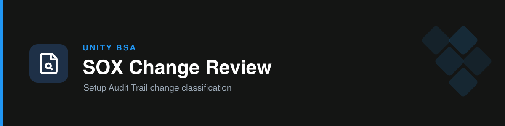

# sox-manual-change-review

**SOX change-management review** of the Salesforce Setup Audit Trail. Classifies a quarter's configuration changes as **Confident Relevant** or **Manual Review** — a single self-contained test (no cross-quarter diff), separate from the access-review skill.

## How it works

- **Filter to scope** — exclude listed users, filter to the quarter, look up each change's Type from its Section.
- **Classify by whitelist** — relevance comes from a maintained whitelist of specific Flow / Approval-Process / Validation-Rule names. Two alternatives were tested on 2,203 real historical labels and rejected (Type-based = 10% accuracy; generic financial-keyword = 47% precision); the whitelist reached **91.9% precision / 86.2% recall**. Don't reinvent a keyword rule — it's already been shown not to work on this data.
- **Whitelist accumulates** — after each quarter's Manual Review bucket, confirmed names are promoted and persisted across quarters (never rebuilt from scratch).
- **Gaps surfaced, not guessed** — `Section` values missing from the `Section → Type` tab are reported by name as real documentation gaps, never silently defaulted.
- **Built for scale** — this source runs 50,000+ rows; the skill always runs the script (never eyeballs) and follows the documented `read_only` / styling performance notes.

## Workflow

```bash
python scripts/change_mgmt_classify.py <raw_data_file> <exclude_users_file> \
    <section_type_file> references/change-mgmt-whitelist.json <output_xlsx> \
    --quarter Q2 --data-sheet "Raw Data"
```
Output: `Q<N> Data Filtered` (all in-scope rows; green = Confident Relevant, orange = Manual Review) and `Q<N> Changes to Review` (Confident Relevant only). No live-Sheet cell editing — deliverables are downloadable xlsx + paste instructions.

## Triggers

change management review, audit trail, Setup Audit Trail, SetupAuditTrail, manual change review, or an export with Date/User/Action/Section/Delegate User columns.

## Boundary

Setup Audit Trail change classification only. User/Profile and PermissionSetAssignment access reviews live in the separate [`sox-salesforce-access-review`](../sox-salesforce-access-review) skill.

## References & scripts

- `references/` — `change-mgmt-schema.md`, `change-mgmt-relevance-rules.md`, `change-mgmt-whitelist.json`
- `scripts/` — `change_mgmt_classify.py`
