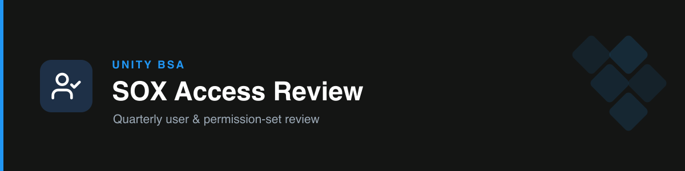

# sox-salesforce-access-review

Quarterly **SOX access review** of Salesforce user access and permissions — two distinct, independently-runnable tests that compare this quarter against last, flag changes, and surface genuine exceptions against the approved-profile rules.

## The two tests

| | Test 1 — ProfileStrongPermission | Test 2 — ProfilePermissionSets |
| --- | --- | --- |
| Salesforce object | `User` / `Profile` | `PermissionSetAssignment` |
| Match key | `Id` | `(Assignee.Username, PermissionSet.Name)` |
| Scripts | `compare_quarters.py`, `flag_exceptions.py` | `permset_compare.py`, `permset_exceptions.py` |
| Schema ref | `references/column-schema.md` | `references/permset-schema.md` |
| Rules ref | `references/definition-rules.md` | `references/permset-definition-rules.md` |

> The skill **always confirms which test** before running anything — the two use different data, sheets, and Drive files.

## How it works

- **Compare quarters** → new / removed / changed rows, written to a highlighted `To Review`-shaped workbook.
- **Flag exceptions** → only genuine violations, with approved profiles already excluded; named-individual and unresolved cases routed to a separate "Manual Review Needed" bucket.
- **Judgment preserved** — exceptions are presented with a note on whether each looks real or benign; the reviewer decides.
- **No live-Sheet cell editing** — clones the prior quarter's Sheet via Drive, then delivers a highlighted xlsx + exact `Definition!E` annotation instructions to paste by hand.
- **Validate before trusting** — logic is checked against a prior-quarter self-comparison (expect zero diff) before running on new data.

## Triggers

SOX review, quarterly access review, new quarter, RawData, To Review tab, permissions changed, Definition tab, approved profiles, exceptions, PermissionSetAssignment.

## Boundary

Covers User/Profile and PermissionSetAssignment only. Setup Audit Trail change review lives in the separate [`sox-manual-change-review`](../sox-manual-change-review) skill — the two are never conflated.

## References & scripts

- `references/` — `column-schema.md`, `permset-schema.md`, `definition-rules.md`, `permset-definition-rules.md`
- `scripts/` — `compare_quarters.py`, `flag_exceptions.py`, `permset_compare.py`, `permset_exceptions.py`
